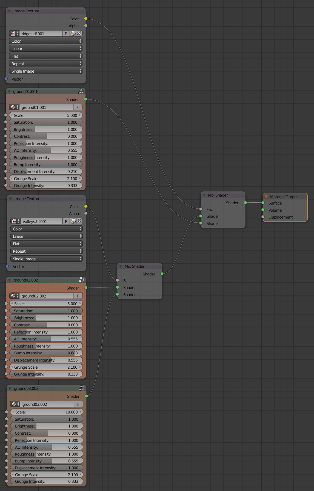
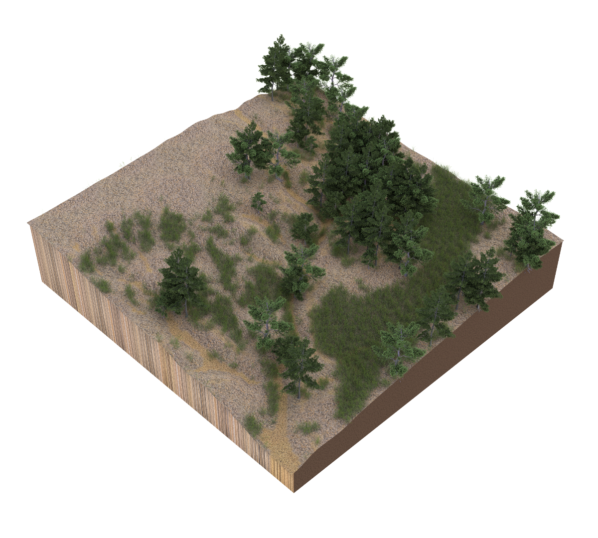

# Contents
1. [**3D ecosystems**](#3d-ecosystems)
    1. [Image classification](#image-classification)
    2. [Landform classification](#landform-classification)
    3. [Export geospatial data](#export-geospatial-data)
    4. [3D terrain](#3d-terrain)
    5. [3D planting](#3d-planting)
    6. [Particle systems](#particle-systems)
    7. [Rendering](#rendering)
    8. [Physics](#physics)

# 3D ecosystems

## Image classification
Start GRASS GIS in the `nc_spm_evolution` location
and create a new `imagery` mapset.
Set your region to our study area with 1 meter resolution
using the module
[g.region](https://grass.osgeo.org/grass72/manuals/g.region.html).
```
g.region region=region res=1
```

### Importing orthophotography
Import the National Agriculture Imagery Program (NAIP)
orthophotograph from 2014 for the study area with
[r.import](https://grass.osgeo.org/grass72/manuals/r.import.html).
Set the extent to the region.
Then composite the red, green, and blue channels
to generate a natural color map using
[r.composite](https://grass.osgeo.org/grass72/manuals/r.composite.html).
```
r.import input=D:\fort_bragg_data\m_3507963_ne_17_1_20140517.tif output=imagery_2014 title=imagery_2014 resample=nearest resolution=value resolution_value=1 extent=region
r.composite red=imagery_2014.1 green=imagery_2014.2 blue=imagery_2014.3 output=imagery_2014
```

### Unsupervised image classification
Start GRASS GIS in the `nc_spm_evolution` location
and open the `imagery` mapset.
Set your region to our study area with 1 meter resolution
using the module
[g.region](https://grass.osgeo.org/grass72/manuals/g.region.html).
Create a imagery group using the red, green, and blue channels
of the 2014 NAIP orthophotograph with
[i.group](https://grass.osgeo.org/grass72/manuals/i.group.html).
Generate a spectral signatures for landcover based on clustering using
[i.cluster](https://grass.osgeo.org/grass72/manuals/i.cluster.html).
In the settings tab set the initial number of classes to 2,
i.e. bare ground vs vegetation.
Use the spectral signature to classify the landcover
based on maximum-likelihood discriminant analysis
with the module
[i.maxlik](https://grass.osgeo.org/grass72/manuals/i.maxlik.html).

```
g.region region=region res=1
i.group group=imagery subgroup=imagery_2014 input=imagery_2014.1,imagery_2014.2,imagery_2014.3
i.cluster group=imagery subgroup=imagery_2014 signaturefile=signature_imagery_2014 classes=2
i.maxlik group=imagery subgroup=imagery_2014 signaturefile=signature_imagery_2014 output=classification_imagery_2014
```

Use the module [r.recode](https://grass.osgeo.org/grass72/manuals/r.recode.html)
to recode the classified imagery using the rules file
`imagery_to_landcover.txt` stored in the `nc_spm_evolution` location.
This will reassign class 1 to the National Landcover Dataset's (NLCD)
class 71, i.e. *Grassland/Herbaceuous*.
And it will reassign class 2 to NCLD's class 31, i.e. *Barren Land*.
You should have created a map of vegetation
based on classified lidar data called `vegetation_2012`
in the [Lidar](#lidar) tutorial.
Run `g.mapset` and check the `lidar` mapset to access that data.
If you did not create `vegetation_2012`
you can use the copy in the `PERMANENT` mapset.
Use map algebra with
[r.mapcalc](https://grass.osgeo.org/grass72/manuals/r.mapcalc.html)
to combine the lidar based trees and shrub
(reassigned as NLCD class 43, i.e. Mixed Forest)
with the imagery based grass and barren land.
Then assign the NLCD color table from the
`color_landcover.txt` rules file with
[r.color](https://grass.osgeo.org/grass72/manuals/r.colors.html).
Finally assign text labels to the class numbers
based on the rules file `landcover_categories.txt` using
[r.category](https://grass.osgeo.org/grass72/manuals/r.category.html)
```
r.recode input=classification_imagery_2014 output=recode_imagery_2014 rules=imagery_to_landcover.txt
r.mapcalc "landcover = if(isnull(vegetation_2012), recode_imagery_2014, 43)"
r.colors map=landcover rules=color_landcover.txt
r.category map=landcover separator=pipe rules=landcover_categories.txt
```

## Landform classification
Start GRASS GIS in the `nc_spm_evolution` location
and open the `terrain_analysis` mapset.
Set your region to the study area
with 1 meter resolution
using the module
[g.region](https://grass.osgeo.org/grass72/manuals/g.region.html).
Specifying the saved region `region`.
```
g.region region=region res=1
```

Compute landform types uses the add-on module
[r.geomorphon](https://grass.osgeo.org/grass72/manuals/addons/r.geomorphon.html).
 ```
r.geomorphon elevation=elevation_2016 forms=forms search=24 skip=0 flat=1 dist=0
 ```
<p align="center">
  
</p>

## Export geospatial data
Start GRASS GIS in the `nc_spm_evolution` location
and open the `PERMANENT` mapset.

### Export terrain data
Set a new region for a smaller study area
using the module
[g.region](https://grass.osgeo.org/grass72/manuals/g.region.html).
Use map algebra with
[r.mapcalc](https://grass.osgeo.org/grass72/manuals/r.mapcalc.html)
to create a cropped version of the elevation map.
Export this cropped digital elevation model as a GeoTIFF using
[r.out.gdal](https://grass.osgeo.org/grass72/manuals/r.out.gdal.html).
```
g.region n=150862 s=150712 w=597290 e=597440 save=subregion res=1
r.mapcalc expression="elevation = elevation_2016"
r.out.gdal input=elevation output=elevation.tif format=GTiff
```

### Export imagery
Set your region to our smaller, detailed study area
with 1 meter resolution using the module
[g.region](https://grass.osgeo.org/grass72/manuals/g.region.html).
Specify the saved region `subregion`.
Use map algebra with
[r.mapcalc](https://grass.osgeo.org/grass72/manuals/r.mapcalc.html)
to create separate maps of bare ground, mixed forest, and grass.
Then export these landcover maps as GeoTIFFs using
[r.out.gdal](https://grass.osgeo.org/grass72/manuals/r.out.gdal.html).
You will use these landcover maps to generate particle systems of 3D plants.
```
r.mapcalc expression="bare_ground = if(landcover==31,1,0)"
r.colors map=bare_ground color=grey
r.mapcalc expression="mixed_forest = if(landcover==43,1,0)"
r.colors map=mixed_forest color=grey
r.mapcalc expression="grass = if(landcover==71,1,0)"
r.colors map=grass color=grey
```

### Export landform data
Change the mapset to `terrain_analysis` using
[g.mapset](https://grass.osgeo.org/grass72/manuals/g.mapset.html).
Set your region to our smaller, detailed study area
with 1 meter resolution using the module
[g.region](https://grass.osgeo.org/grass72/manuals/g.region.html).
Specify the saved region `subregion`.
Use the map algebra with the raster map calculator
[r.mapcalc](https://grass.osgeo.org/grass72/manuals/r.mapcalc.html)
to create maps of similar landforms typologies.
Export these as GeoTIFFs using
[r.out.gdal](https://grass.osgeo.org/grass72/manuals/r.out.gdal.html).
You will use these landform maps to map earth and ground cover textures.
```
g.mapset mapset=terrain_analysis
g.region region=subregion res=1
r.mapcalc expression="landforms = landforms_2016"
r.mapcalc expression="ridges = if(landforms==8 ||| landforms==9 ||| landforms==10,1,0)"
r.colors map=valleys color=grey
r.mapcalc expression="ridges = if(landforms==2 ||| landforms==3 ||| landforms==4,1,0)" --overwrite
r.colors map=ridges color=grey
r.mapcalc expression="slopes = if(landforms==6,1,0)" --overwrite
r.colors map=slopes color=grey
```

### Print region
Run g.region with the `p` flag to print the boundaries.
Copy the `south` and `west` boundary values.
You will use these to set your origin of your scene in Blender.
```
g.region -p  
```
The output will be:
```
projection: 99 (NAD83(HARN) / North Carolina)
zone:       0
datum:      nad83harn
ellipsoid:  grs80
north:      150870
south:      150720
west:       597290
east:       597440
nsres:      1
ewres:      1
rows:       150
cols:       150
cells:      22500
```

## 3D terrain

### Importing geospatial data into Blender
Download the
[zip archive](https://github.com/domlysz/BlenderGIS/archive/master.zip)
for the
[BlenderGIS add-on](https://github.com/domlysz/BlenderGIS).
See its [wiki](https://github.com/domlysz/BlenderGIS/wiki)
for detailed instructions about installing and using the add-on.

Launch Blender.
Set the renderer to `Cycles Render`.
In the `File` menu open `User Preferences` (Ctrl + Alt + U).
In the `Add-ons` tab click `Install from File...`
and select `BlenderGIS-master.zip`.
Check and then expand `3D View: BlenderGIS`.
Set the BlenderGIS' `Spatial Reference Systems`
to North Carolina State Plane Meters
by clicking `Add` and then setting the EPSG code with
`Definition: 3358`,
`Description: NAD83(HARN) / North Carolina`,
and checking `Save to addon preferences`.
Then click `Ok`.
Select the new `NAD83(HARN) / North Carolina` spatial reference system.
Click `Save User Settings`
and close the User Preferences dialog.

*Nota bene:* you can search for EPSG codes on the web at either
[epsg.io](epsg.io)
or [http://spatialreference.org/](http://spatialreference.org/).
Try searching either site for `North Carolina` then select
the result with the North American Datum of 1983 (NAD83)
and North Carolina State Plane
(High Accuracy Reference Network) with meters as the unit.
The EPSG code will be `3358`.

In Blender set the 3D viewport to `Top Ortho`.
First set `Ortho` by pressing `5` on the numeric keypad
then set `Top` by pressing `7` on the numeric keypad.
*Nota bene:* [numeric keypad hotkeys](https://en.wikibooks.org/wiki/Blender_3D:_HotKeys/3D_View/Object_Mode)

Delete the default cube.

Open the `GIS` tab added by Blender GIS.
First set your spatial reference system
Under `Geoscene` click the

`Switch scene crs` button
and select `NAD83 / North Carolina`
from the dropdown menu and press `Ok`.
Then set the `scene origin coordinates` to `Proj` and
set `crs x: 597290` and `crs y: 150720`
to match the west and south boundaries determined in GRASS GIS.

Import `elevation.tif` into Blender using
`File > Import > Georeferenced raster`
or the

`Import georeferenced raster with world file` button in the GIS tab.
Select `elevation.tif`. then in the `Import georaster` panel
set `Mode: As DEM`,
set `Subdivision: Mesh`
and finally click `Import georaster`.
See the BlenderGIS
[wiki](https://github.com/domlysz/BlenderGIS/wiki/Import-georef-raster).
for more details about importing georeferenced rasters.

To vertically exaggerate the digital elevation model
select `elevation` in the Outliner,
and open the

`Modifiers` panel.
This will show the parameters for the
[displace](https://docs.blender.org/manual/en/dev/modeling/modifiers/deform/displace.html)
modifier used to generate a mesh from the raster values.
Set `Strength: 2.0`
to vertically exaggerate by a factor of 2.
Click `Apply` to make this displace modifier permanent.

Create a base for the terrain
by copying and pasting the `elevation` mesh.
Make sure that the displacement modifier has been applied
or you will get an error in following steps.
Select this new copy.
Rename it `base`.
Enter edit mode with `tab`.
Extrude Region with `e `
then type `-25` to extrude -50 meter vertically.
Scale with `s`, type `z` to constrain to the z-axis,
and type `0` to flatten the base.
Press `tab` to return to object mode.

Use a sun to light the scene.
Select `Lamp` in the Outliner
and open the

`Data` panel.
Set `Lamp` to `Sun`.
Move the sun 1000 units vertically.

Save your scene as `nspm_evolution.blend` (Shift + Ctrl + S).

### Simple ground texture
Select our terrain mesh `elevation` in the Outliner.
In the 
`Material` panel
open the `Cycles Material Vault`,
click on `Category Type`,
select `Ground`,
browse to select `Ground01`,
and click `Assign Material`.
Then in the `Surface` tab of the `Material` panel
set `Scale: 10`.

Save your scene (Ctrl + S).

### Ground texture from landforms
*Under development...*




## 3D planting
This section describes how to setup [Xfrog](xfrog.com/) 3D trees for
Blender's Cycles renderer.
Xfrog is software for procedurally generating 3D plants.
We will use libraries of 3D trees, shrubs, and grasses created in Xfrog
to model the ecosystem of our study landscape.
The following steps detail how to setup an Eastern White Pine
and should be adapted accordingly for other plants.
The instructions for this section are also available as a
[spreadsheet](https://docs.google.com/spreadsheets/d/1hc24iUS0iS9Jv8Kwcr09twPLLuGAd1R4tEw8rD2qJPA/edit?usp=sharing).

First, check your settings.
Open `System settings` by hotkey (Ctl + Alt + U)
or through the menu `File > User Preferences > System`.
Uncheck `Mipmaps`.
Set `Clip alpha` to 0.
Turn off `Anisotropic Filtering`.
Depending on your hardware, select a
`Cycles Compute Device`
such as CUDA for NVDIA GPUs.
Be sure to `Save User Settings`!

Set up a new scene in Blender for preparing an [Xfrog](xfrog.com/) 3D tree.
Delete the cube.
Then set the render engine to `Cycles Render`.
Optionally highlight the lamp in the Outliner,
then in the Data tab, change Lamp from Point to Sun,
and then in the World tab, check Blend Sky.

Next import the 3D tree.
With `File > Import > Wavefront (.obj)`
import `\XfrogPlants\XfrogPlants_USA_East_OBJ\Models\EA12_Pinus strobus_Eastern_White_Pine\EA12a.obj`.
Then highlight `EA12a` in the Outliner.
Rename `EA12a` to `Eastern White Pine A`.
In the Object tab, change Rotation parameter X from 90d to 0.
Optionally adjust the 3D view settings by pressing `n` to open the side panel,
expanding the Display menu, and unchecking Outline Selected.
Press `r` for Rendered viewport shading.

Set up the leaf materials for the tree.
In the Outliner, expand Eastern White Pine A, expand EA12a, and select Needle.
In the Material tab, select Leaf,
then under Surface click the `Use Nodes` button.
Open the Node Editor.
In the Node Editor
there will be a `Diffuse BSDF` connected to `Material Output`.
Add a `Mix Shader`.
Connect Diffuse BSDF's BSDF output to Mix Shader's 2nd Shader input.
Connect Mix Shader's Shader output to Material Ouput's Surface input.
Add a `Transparent BSDF`.
Connect Transparent BSDF's BSDF output to Mix Shader's 1st Shader input.
Add an `Image Texture`.
In Image Texture open the leaf's image file `EA12ned.tif`.
Connect Image Texture's Color output to Diffuse BSDF's Color input.
Connect Image Texture's Alpha output to Mix Shader's Factor (Fac) input.

Now setup the bark materials for the tree.
In the Outliner, expand Eastern White Pine A, expand EA12a, and select Bark.
In the Material tab, select Bark,
then under Surface click the `Use Nodes` button.
Open the Node Editor.
In the Node Editor
there will be a `Diffuse BSDF` connected to `Material Output`.
Add an `Image Texture`.
In Image Texture open the bark's image file `EA12brk.tif`.
Connect Image Texture's Color output to Diffuse BSDF's Color input.
Add an `Image Texture`.
In Image Texture open the bark's bump map image file `EA12brk_b.tif`.
Add a `Bump`.
Connect Image Texture's Color output to Bump's Height input.
Connect Bump's Normal output to Diffuse BSDF's Normal input.
Optionally set Bump's strength to 2 or higher.

Optionally setup the world environment.
In the World tab click the `Use Nodes` button.
Set Color to `Sky Texture`.
Select `Hosek / Wilkie` or `Preetham`.
Check `Ambient Occlusion` and set to 0.5.

To save your 3D tree, first store the linked files
such as the `.obj` and the `.tif`s
with `External Data > Pack all into .blend`.
Then `Select All`  (A), group (Crtl+G), and
assign the group a name such as `Eastern White Pine A`.
Save as (Shift+Ctrl+S) `c_eastern_white_pine_a.blend`.

## Particle systems

### Forest particle system
First on a new layer append
`plant_library\c_eastern_white_pine_a.blend\Group\eastern_white_pine`.

In the 
`Textures` panel
create a `Mixed forest` texture with
`mixed_forest.tif`.

Open the

`Particles` panel.
Click `New` to create a new particle system.
Rename as `Forest`.
In the `Emission` tab
set `Type` to `Emitter`,
`Number` to `500`,
`Start` to `-1`, and
`End` to `-1`
(so that all particle will appear in the first time step).

In the `Texture` tab of the `Particles` panel
add the `Mixed forest` texture.

Switch to the `Texture` panel.
Select the `Mixed forest` texture.
In the `Influence` tab uncheck
`Time` and check `Influence: 1.0`

Back in the `Particles` panels
in the `Rendered` tab
select `Group`, click `Dupli Group` and browse to select the
`eastern_white_pine` group.
Set `Size: 0.1` amd `Random Size: 0.05`

Save your scene (Ctrl + S).

### Grass particle system
In a new layer append
`D:\GrassEssentials\Grass Essentials - Grass Models v1.2\Grass\Kentucky Bluegrass\Grass_Kentucky Bluegrass.blend\Group\APPEND - Grass_Kentucky_Bluegrass - Particles Setup`.

In another new layer append
`D:\GrassEssentials\Grass Essentials - Grass Models v1.2\Grass\Meadow Fescues\Grass_Meadow Fescues.blend\Group\APPEND - Grass_Meadow Fescues - Particles Setup`.

Open the

`Particles` panel.
Click `New` to create a new particle system.
Rename as `Bluegrass`.
Under `Settings` use the

`Browse particle settings to be linked` dropdown menu
to select the appended Kentucky Bluegrass particle system.
In the `Emissions` tab of the `Particles` panel
set `Number: 100000`
and `Hair Length: 50`
In the `Texture` tab of the `Particles` panel
add a new texture called `grass`.
Use the `Show texture in texture tab` button

to open the `Texture` panel.
In the `Texture` panel set the image texture to `grass.tif`.
In the `Influence` tab uncheck
`Time` and check `Influence: 1.0`

Repeat for the Meadow Fescues particle system.
Use a lower number of emissions (e.g. 10000).

Save your scene (Ctrl + S).

## Rendering
Select the terrain mesh `subregion` in the Outliner.
Use `Numpad .` to focus your viewport on your selection.

Align your camera with the viewport using
`Ctrl + Alt + Numpad 0`.

Use `Numpad 0` to toggle between camera view and the viewport view.

Press `F12` to Render.
Once the rendering finishes
click `Image > Save as`.

<p align="center">
  
  
</p>



*Under development...*

## Physics
*Under development...*
